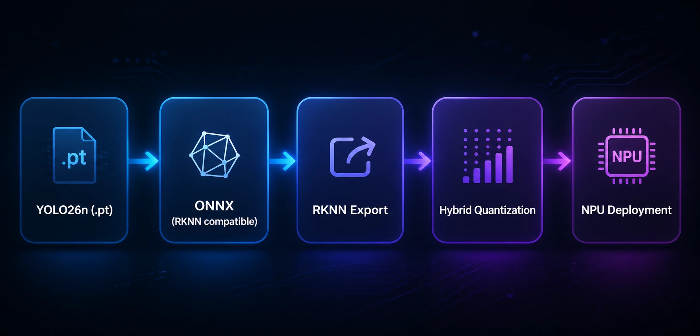

# YOLO26 on RK3588; Hybrid INT8 Quantization (RKNN)

Deploy **YOLO26n** on **Rockchip RK3588 NPU** using **hybrid INT8 quantization** with RKNN Toolkit.

This repository provides a workflow for converting a YOLO26 model to **RKNN format** and optimizing it for edge inference.

## Demo

Below is a side‑by‑side comparison on a memorable clip: **Messi’s goal in the World Cup Final (France vs Argentina)**.

Comparison of three inference modes:
- CPU inference  
- NPU without quantization  
- NPU with hybrid INT8 quantization  


https://github.com/user-attachments/assets/e7b95461-892a-47ef-8149-e8c664914115

## Performance

| Platform | FPS |
|----------|------|
| CPU (i5‑10th Gen) | ~10 |
| RK3588 NPU (no quantization) | ~21 |
| RK3588 NPU (hybrid INT8) | ~38 |

Hybrid quantization improves throughput by **~4× compared to CPU inference**.


## Conversion Pipeline
Below is a diagram of the model conversion pipeline:



## 1. Environment Setup

First, install **Ultralytics**:

```bash
pip install ultralytics
```

Ensure that `rknn-toolkit2` is installed and correctly configured for your target platform.

This pipeline was tested with:

```text
rknn-toolkit2 == 2.3.2
```

## 2. Export YOLO26n to RKNN (No Quantization)

Ultralytics provides a CLI tool to export YOLO models to RKNN:

```bash
yolo export model=yolo26n.pt format=rknn name=rk3588 opset=13
```

### Important Notes

- **ONNX opset must be lower than 19**
- This export path performs **floating-point (FP) conversion only**
- **Quantization is not currently implemented** in the Ultralytics RKNN backend

⚠️ **Do not** attempt to manually add quantization logic to `exporter.py`. This can produce invalid graphs where some output layers collapse to zero. To avoid this issue, a **hybrid quantization workflow** must be used instead.


## 3. Hybrid Quantization Overview

Hybrid quantization allows you to Keep sensitive layers (e.g. detection outputs) in **floating-point (FP16 or FP32)**


## 4. Calibration Dataset Requirements

Quantization requires a **calibration dataset**.

### Best Practices

- Use **100–200 images**
- Ensure the dataset is **diverse**
- Data should closely **match real inference conditions**

Example:
- If the model was fine-tuned on **footbal games**, the calibration dataset should also contain representative same samples

You must provide a `.txt` file containing **absolute paths** to the calibration images.


## 5. Hybrid Quantization Conversion Script
Use `onnx_to_rknn_hybrid.py` to perform **two-step hybrid quantization** using `rknn-toolkit2`.


### Important Note (ONNX Source)

For hybrid quantization, you **must use the ONNX file generated by the RKNN export path**, not the standard ONNX export:

```bash
yolo export model=yolo26n.pt format=rknn name=rk3588 opset=13
```

The ONNX file produced by `format=onnx` **will not work correctly** for this hybrid quantization flow. The RKNN-exported ONNX graph is required.


## 6. Step 1: Generate Quantization Configuration

Run the first hybrid quantization step:

```bash
python3 onnx_to_rknn_hybrid.py \
  --weights yolo26n.onnx \
  --dataset new_calibration.txt \
  --step 1 \
  --target rk3588 \
  --output yolo26n_hybrid.rknn
```

This step generates several intermediate files, including:

- `.quantization.cfg`
- `.model`
- `.data`

## 7. Modify Quantization Configuration

Open the generated `.quantization.cfg` file and modify the first section.

### Change this:

```yaml
custom_quantize_layers: {}
```

### To this:

```yaml
custom_quantize_layers:
  output0-rs: float16
  output0: float16
```

This keeps the detection output layers in **FP16**, preventing zeroed or corrupted outputs.


## 8. Step 2: Final RKNN Export

Run the second hybrid quantization step:

```bash
python3 onnx_to_rknn_hybrid.py \
  --weights yolo26n.onnx \
  --dataset new_calibration.txt \
  --step 2 \
  --target rk3588 \
  --output yolo26n_hybrid.rknn
```

## Limitations

- This repository focuses specifically on quantizing **YOLO26n**.  
  If you work with another YOLO26 variant, you must verify which **output‑related layers** produce zero or unstable results after full INT8 quantization. These layers should remain in **FP16**.
- The root cause is that **RKNN does not support the Top‑K operator**, which affects post‑processing logic and can lead to empty detections if quantized incorrectly.

## Note

A potential alternative fix has been discussed [here](https://github.com/ultralytics/ultralytics/issues/23340#issuecomment-3789012212).  I have not tested this method yet.

## 🙌 Acknowledgments

This work benefited from the helpful discussion [here](https://github.com/ultralytics/ultralytics/issues/23340). 
